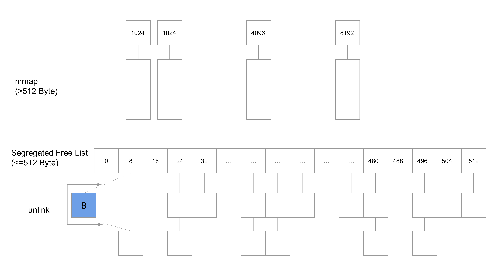
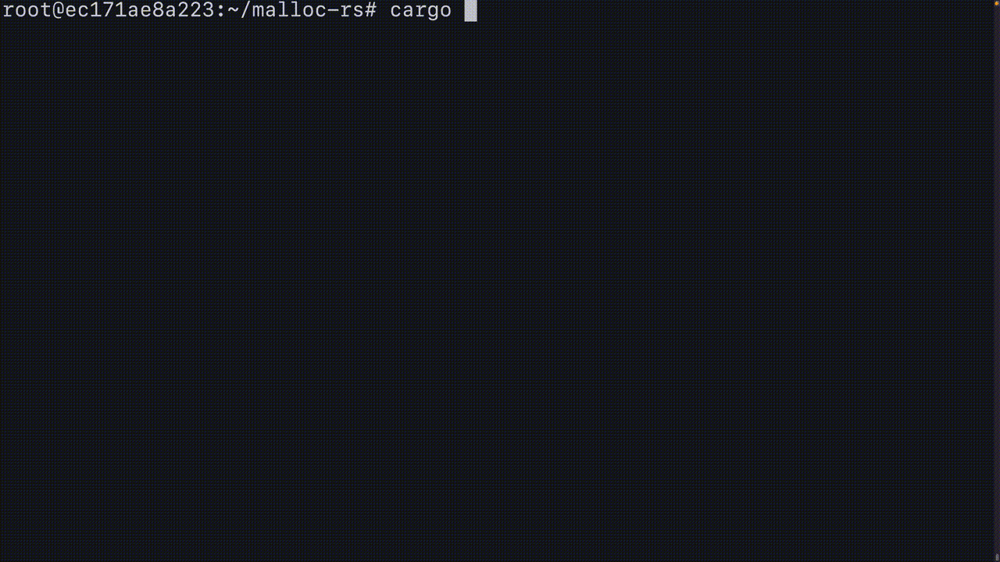

# malloc-rs

Implementation of malloc, realloc, calloc, and free in Rust.

*Note: No thread safe*

## Architecture



512 bytes or less is allocated by Segregated Free List, and more than 512 bytes is allocated by mmap.

## Usage

```bash
git clone https://github.com/suzusuzu/malloc-rs.git
cd malloc-rs
cargo build
export LD_PRELOAD=`pwd`/target/debug/libmalloc_rs.so # malloc-rs allocator
# python3 -c 'print("hello world")'
unset LD_PRELOAD # system allocator
```

## Demo

### Python(numpy)

```bash
cargo build
export LD_PRELOAD=`pwd`/target/debug/libmalloc_rs.so
python3 <<EOF
import numpy as np
import random
while True:
    print(np.sum(np.random.random(random.randint(1000, 10000))))
EOF
```


### vim(invader.vim)

[mattn/invader-vim](https://github.com/mattn/invader-vim)

```bash
cargo build
export LD_PRELOAD=`pwd`/target/debug/libmalloc_rs.so
wget https://raw.githubusercontent.com/mattn/invader-vim/master/plugin/invader.vim
vim
#:source ./invader.vim
#:Invader
```

